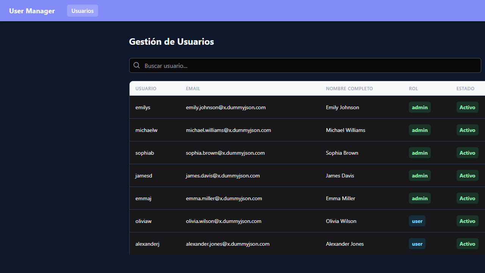
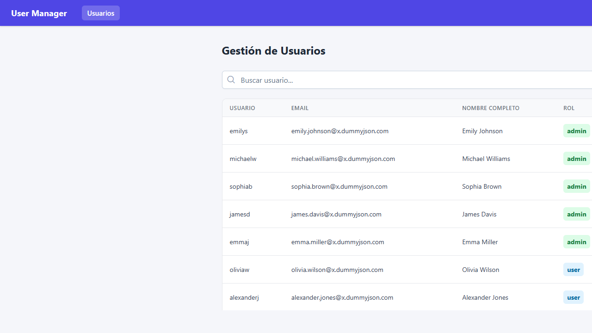
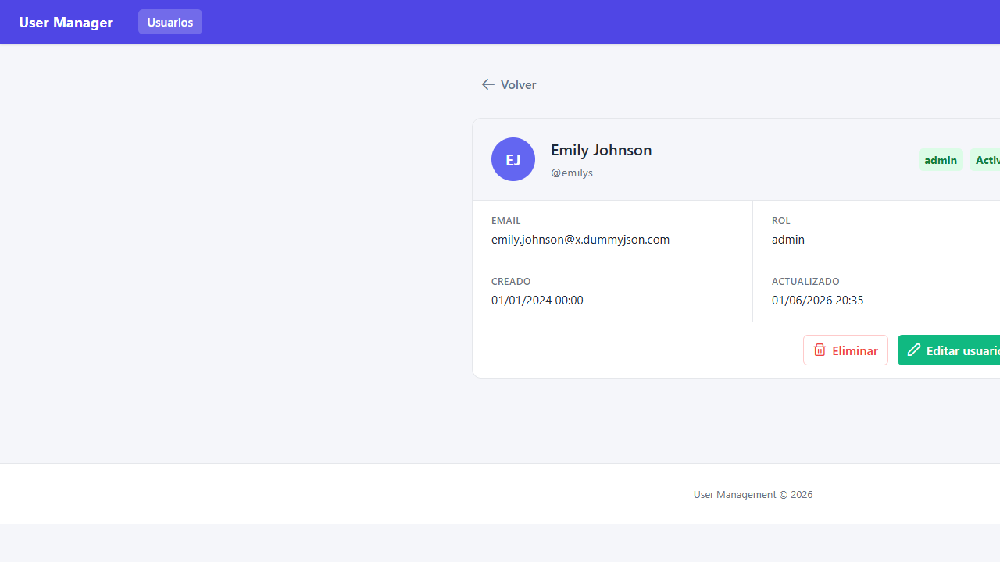
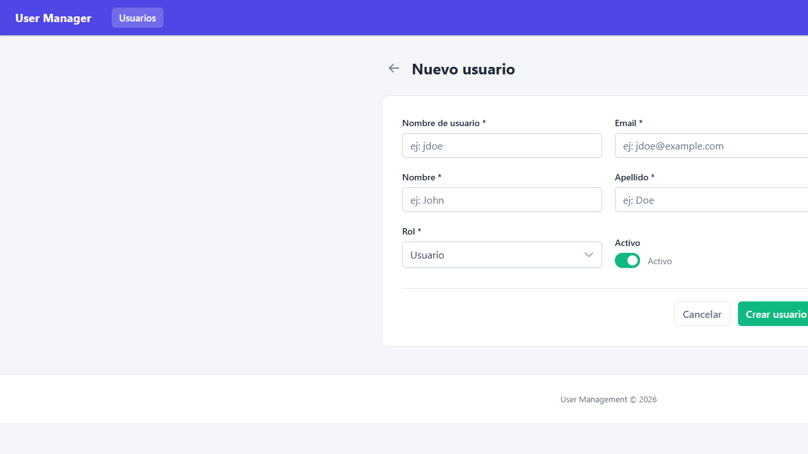
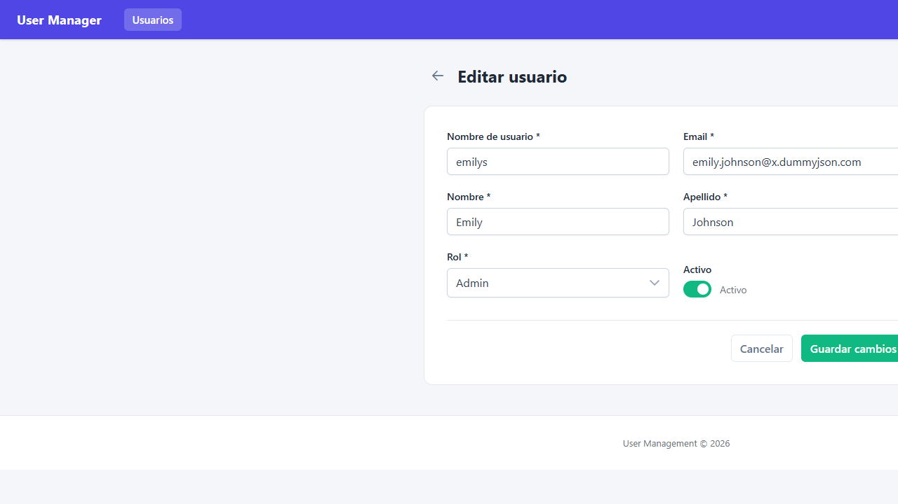

# Challenge Frontend App — User Management SPA

A full-featured CRUD Single Page Application built as a frontend engineering challenge.
Stack: **Angular 21 · PrimeNG 21 · Tailwind CSS 4 · Vitest 4**.

---

## Screenshots

|                        User List (dark)                        |                        User List (light)                         |
| :------------------------------------------------------------: | :--------------------------------------------------------------: |
|  |  |

|                     User Detail                     |                    User Form — Create                    |
| :-------------------------------------------------: | :------------------------------------------------------: |
|  |  |

|                   User Form — Edit                   |
| :--------------------------------------------------: |
|  |

---

## Features

### Core

- **User list** with server-side pagination, debounced search, and role/status filters
- **User detail** view with structured data display and avatar initials
- **Create / Edit** form with reactive validation (custom validators, aria attributes)
- **Delete** with optimistic UI update and rollback on error
- **Toast notifications** (PrimeNG) for success/error feedback
- **Confirm dialog** before destructive actions
- **WCAG 2.1 AA** accessible: skip link, `aria-busy`, `aria-live`, keyboard nav, focus-visible
- **Responsive** layout — columns hidden progressively on tablet/mobile
- **Route guards**: `numericIdGuard` (validates `:id` is a positive integer), `pendingChangesGuard` (blocks navigation when form has unsaved changes)
- **30 unit tests** across services, store, validators and components

### Bonus

- **Dark mode** — toggle in header, persisted in `localStorage`, respects `prefers-color-scheme`
- **i18n EN/ES** — language toggle, signal-based `I18nService` + `TranslatePipe`, persisted in `localStorage`
- **Skeleton loaders** — table rows animated while data loads (no spinner)
- **Husky + lint-staged** — pre-commit hook runs Prettier on all staged files
- **Playwright E2E** — smoke tests for shell, user list, and navigation flows

---

## Tech Stack

| Layer      | Technology                                  | Version |
| ---------- | ------------------------------------------- | ------- |
| Framework  | Angular (standalone components)             | 21      |
| UI library | PrimeNG + Aura theme                        | 21      |
| Styling    | Tailwind CSS 4 (Vite plugin)                | 4.3     |
| State      | Angular Signals Store (service-based)       | —       |
| HTTP       | Angular HttpClient + functional interceptor | —       |
| Testing    | Vitest + @angular/build:unit-test           | 4       |
| API        | DummyJSON (public REST mock)                | —       |

---

## Prerequisites

- **Node.js** >= 20.x
- **npm** >= 10.x
- **Angular CLI** 21 (`npm i -g @angular/cli@21`)

---

## Getting Started

```bash
# 1. Clone
git clone https://github.com/ErlynPino/challenge-frontend-app.git
cd challenge-frontend-app

# 2. Install dependencies
npm install

# 3. Start dev server
npm start
# App available at http://localhost:4200
```

---

## Available Scripts

| Command         | Description                                    |
| --------------- | ---------------------------------------------- |
| `npm start`     | Start dev server (`ng serve`) with live reload |
| `npm run build` | Production build — output in `dist/`           |
| `npm test`      | Run all unit tests once (no watch)             |
| `npm run e2e`   | Run Playwright E2E tests (requires dev server) |

---

## Project Structure

```
src/
├── app/
│   ├── app.config.ts          # Bootstrap providers
│   ├── app.routes.ts          # Root routing
│   ├── core/
│   │   ├── interceptors/      # apiInterceptor — prepends base URL, logs errors
│   │   └── services/          # LoggerService (silenced in production)
│   ├── environment/           # ENVIRONMENT InjectionToken + values
│   ├── layout/shell/          # App shell: header + skip-link + toast + confirm dialog
│   └── features/users/
│       ├── models/            # User, DTO, DummyJSON types + mapper function
│       ├── services/          # UserService (HTTP CRUD)
│       ├── store/             # UserStore (Signals — state, computed, actions)
│       └── pages/
│           ├── user-list/     # Table, pagination, search, filters
│           ├── user-detail/   # Read-only detail card
│           └── user-form/     # Reactive form — create & edit
├── styles.scss                # Tailwind layers, CSS custom properties, WCAG utilities
└── index.html
```

---

## API Choice — DummyJSON

[DummyJSON](https://dummyjson.com/docs/users) was chosen because:

1. **No auth** — zero setup, focus stays on frontend architecture
2. **Full CRUD surface** — GET list, GET by id, POST, PUT, DELETE all available
3. **Pagination built-in** — `?limit=N&skip=N` mirrors real-world APIs
4. **Search endpoint** — `/users/search?q=` enables server-side search
5. **Simulated writes** — POST/PUT/DELETE return realistic responses even though data is not persisted

> Field mapping: `firstName → first_name`, `lastName → last_name`.
> `created_at` is derived from `id` (simulated date). `active` defaults to `true`.

---

## Architecture Decisions

### Signals Store (no NgRx)

A service-based Signals store was chosen over NgRx to keep boilerplate minimal while still delivering reactive, computed state without change-detection pressure.

### Optimistic Updates

`deleteUser` and `updateUser` mutate local state immediately and roll back on API error — the user sees instant feedback with no spinner latency.

### Functional Interceptor

A single `apiInterceptor` centralises base-URL prepending and error logging, keeping services clean of environment imports.

### Standalone Components + Lazy Routes

Every feature chunk is lazy-loaded via `loadComponent` / `loadChildren`, giving fast initial load with code-split bundles.

---

## Running Tests

```bash
npm test
```

Output should show **8 test suites · 30 tests · 0 failures**.

| Suite               | Tests |
| ------------------- | ----- |
| LoggerService       | 5     |
| UserService (HTTP)  | 6     |
| UserStore (Signals) | 6     |
| Form validators     | 5     |
| DummyJSON mapper    | 2     |
| ShellComponent      | 2     |
| UserListComponent   | 1     |
| UserDetailComponent | 1     |

---

## License

MIT
